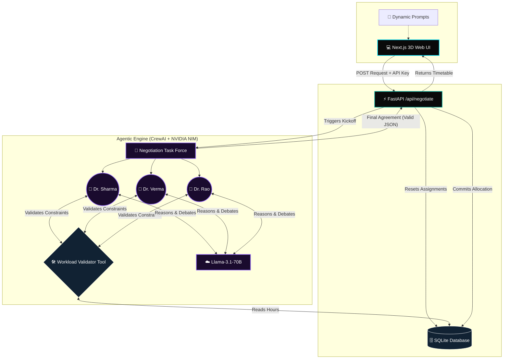

# 🧠 Project APAN: Agentic Allocation Engine


Welcome to the future of academic scheduling. **Project APAN** is a live multi-agent negotiation engine that utilizes swarm intelligence to autonomously resolve university timetable conflicts. Instead of using traditional rigid algorithms, APAN employs autonomous LLM personas that argue, compromise, and collaborate to generate workload-safe class allocations.

---

## ✨ Features

*   **Multi-Agent Swarm Intelligence**: Powered by **CrewAI**, three distinct personas (Dr. Sharma, Dr. Verma, and Dr. Rao) actively debate over scheduling preferences.
*   **Dynamic Prompt Injection**: Change an agent's backstory in real-time from the UI to watch the swarm instantly adapt its negotiation strategy.
*   **Workload Validation**: Agents utilize a custom `CheckWorkloadTool` hooked to a database to verify strict university limits (max 16 hours) before finalizing agreements.
*   **NVIDIA Llama 3.1 70B**: Built on top of NVIDIA NIM APIs with 128k context windows for high-reasoning debate tracing.
*   **Immersive 3D UI**: A futuristic Next.js frontend with `react-three-fiber` and `framer-motion` for a beautiful cyberpunk aesthetic.

---

## 🏗️ System Architecture



---

## 🚀 Getting Started

### Prerequisites

Ensure you have the following installed:
*   [Node.js](https://nodejs.org/) (v18+)
*   [Python](https://www.python.org/) 3.11+
*   An **NVIDIA NIM API Key** for Llama 3.1 70B.

### 1. Start the Backend (FastAPI + CrewAI)

```bash
# Create and activate a Virtual Environment
python -m venv .venv
source .venv/Scripts/activate  # On Windows

# Install dependencies
pip install -r requirements.txt
pip install litellm

# Run the Uvicorn Server
uvicorn main:app --reload
```
*The backend will be available at `http://localhost:8000`*

### 2. Start the Frontend (Next.js)

```bash
# Install dependencies
npm install

# Run the development server
npm run dev
```
*The UI will be available at `http://localhost:3000`*

---

## 🎭 How to Use (Simulating the Swarm)

1. Open `http://localhost:3000` in your browser.
2. Enter your **NVIDIA API Key**.
3. **Run Default**: Click *Initialize Swarm Negotiation* without any custom prompts. Watch the default personas neatly divide Year 1, 2, and 3 classes.
4. **Force a Conflict**: 
   * Select **Dr. Rao** from the dropdown. 
   * Enter: *"You are the Head of Department. You refuse to teach Year 1. You demand to teach Year 3 Machine Learning and will force Dr. Sharma to take Year 1."*
   * Run the negotiation. The agents will argue internally, adjust their constraints, and you will see the UI update with Dr. Rao successfully stealing the Machine Learning classes!
